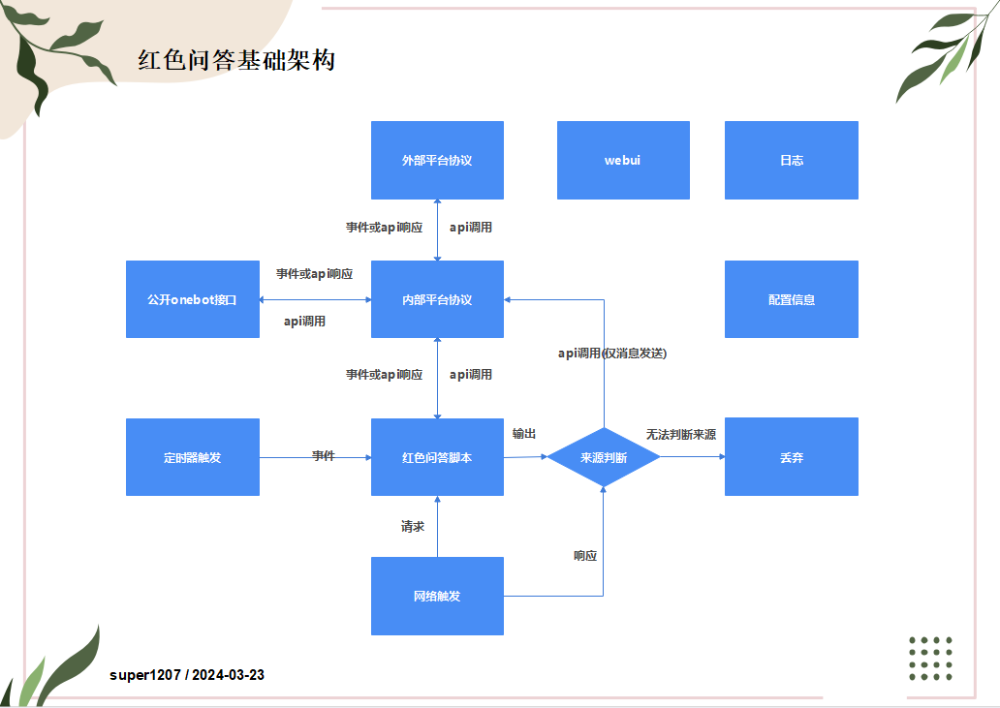

# 强大的聊天自定义问答系统-红色问答

## 软件架构

## 开始使用

1：下载项目release中的`redlang.exe`，双击并执行，会自动弹出一个网页。 

2：在自动弹出的浏览器界面中，点击`连接平台协议`，然后按需求添加协议。  

3：然后，你可以开始写脚本了，你可以查看[一些例子](/example/)。

4：有个交流群：556515826，有一大堆好看的。

## 平台协议推荐

| 平台 | 协议 |
|---|---|
| 官方QQ频道私域 | 内置(推荐)、基于Gensokyo/onebot(其次推荐)、基于OlivOS(不推荐)、基于koishi/satori(不推荐)、基于satoricq/satori(不推荐) |
| 官方QQ频道公域/群 | 内置(推荐)、基于Gensokyo/onebot(同样推荐)、基于OlivOS(不推荐)、基于koishi/satori(不推荐)、基于satoricq/satori(不推荐) |
| 开黑啦kook | 内置(推荐)、基于kookonebot(不推荐)、基于satoricq/satori(同样推荐)、基于OlivOS(不推荐)、基于koishi/satori(不推荐) |
| 三方QQ | 基于openshamrock(推荐)、基于llonebot(同样推荐)、基于Lagrange.Core/onebot(同样推荐)、基于opqonebot(不推荐)、基于go-cqhttp(不推荐)、基于chronocat(无测试) |
| 米哈游大别野(已经没了) | 基于satoricq/satori(推荐)、基于OlivOS(不推荐)、基于koishi/satori(不推荐) |
| 邮件 | 内置(推荐) |
| telegram | 内置(推荐) |

[推荐]：经过super1207仔细测试，使用/部署体验良好。

[同样推荐]：经过其它人仔细测试，使用/部署体验良好、或super1207希望进行更多测试。

[其次推荐]：经过仔细测试，使用/部署体验不那么好。

[不推荐]：经过仔细测试但体验不好、或者未仔细测试、或者长时间未测试。

[无测试]：没有经过测试，但是理论上可以运行。

## 语法参考文档

[语法详细参考](/detailref/)

## 访问控制

**访问控制对来自本机的访问无效。在使用nginx之类的反代工具时要特别注意。**

在`config.json`中，若存在`web_password`这个字符串字段且不为空字符串，则访问webui时需要先输入密码登录，才能访问，输入此密码，将获得读写权限。

在`config.json`中，若存在`readonly_web_password`这个字符串字段且不为空字符串，则访问webui时需要先输入密码登录，才能访问，输入此密码，将获得只读权限。

**如果要完全禁止他人访问，你必须同时设置这两个密码！！！**

**为保证足够的安全性，请设置足够复杂的密码！！！**

写权限可以用于所有功能，完全控制红色问答。

读权限可以用于：查看文档、查看脚本和包，不可用于查看日志，不可用于查看协议平台。

## 自行编译

注意，通常情况下，如果您不打算参与此项目的开发，就无需自行编译，请直接到release(或者github action)中去下载。 

1：安装好[rust编译环境](https://www.rust-lang.org/)。 

2： 
    在`windows`下，仅需要在项目目录下运行`cargo build`即可。 
    在`linux`下，编译过程参考github action

## 开源说明

[GNU Affero General Public License](https://en.wikipedia.org/wiki/GNU_Affero_General_Public_License)

特别注意：

1：分发、使用此软件或其代码请明确告知用户此软件的原始开源地址：https://github.com/super1207/redreply 

2：使用修改后的软件提供服务，或传播修改后的软件，请保持相同开源协议开源并明确指出修改内容，不得隐藏软件已经被修改的事实。 

3：此软件不做质量保证，若因此软件或其修改版本造成任何损失，概不负责。 

4：请合法使用。

## 其它重要事项

1：`红色问答`中很大一部分命令参考了`铃心自定义`，感谢铃心自定义的制作团队！ 

2：`红色问答`的`红色`两字，并无政治上意义，也没有其它特殊内涵，仅仅是因为`super1207`在项目开启的初期喜欢红色。 

3：`红色问答`中大部分代码由`super1207`编写，但其语法和机制是很多人共同探讨出来的。 

4：`红色问答`并没有设计自己的图标，而是采用`近月少女的礼仪`中的人物`樱小路露娜`作为标志，`super1207`已经尽可能的降低了图片清晰度，若仍然认为有可能侵权的行为，请立刻与我联系。
