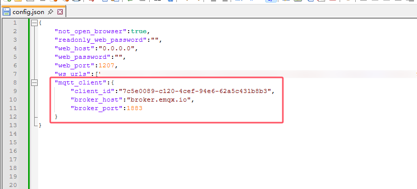

# 红色问答MQTT推送接口(草案)

## 概述

红色问答对外公开MQTT接口，红色问答作为消息发布者。红色问答会将收到的机器人平台事件转化为类似 [onebot11](https://github.com/botuniverse/onebot-11) 格式推送。同时也会公开API调用接口，让订阅者可以调用机器人平台的API。

除此之外，还可以连接多个红色问答，达到共享脚本和适配器的效果。

要使用此推送服务，您需要先自行准备一个支持 mqtt 5.0 的mqtt broker。

## 配置



如上图，在红色问答的配置文件中，添加mqtt相关的配置，其中：

`client_id`: 一个随机的字符串。使用uuid v4生成工具生成即可，作为红色问答的身份标记。

`broker_host`: mqtt的broker服务器地址。要注意，目前仅支持mqtt 5.0的服务器，你可以自建broker服务器，也可以使用公用的免费服务器。但是要注意，公用的broker服务器是不安全的，仅用于测试。

`broker_port`: mqtt的broker服务器端口号。

`broker_username`: mqtt broker的用户名，如果没有可以不填或者填 `null`。

`broker_password`: mqtt broker的密码，如果没有可以不填 `null`。

`remote_clients`: 其它红色问答的 `client_id`，配置了之后，可以接收并处理其它红色问答推送的事件。如果想要处理所有远程红色问答的推送，可以写为:`"remote_clients":["+"]`。

配置好后，要<strong>重启红色问答</strong>才能生效。之后，红色问答会将收到的消息和事件进行推送。

## 消息推送

红色问答的推送的mqtt Topic为：

`bot/<client_id>/<platform>/<self_id>/event`

`client_id`即为上文配置文件中配置的 `client_id` 。

`platform` 和 `self_id` 可以分别通过 `【机器人平台】` 和 `【机器人ID】` 命令得到。

如下是一个例子：

`bot/7c5e0089-c120-4cef-94e6-62a5c431b8b3/onebot11/1736293901/event`

您也可以通过 `bot/7c5e0089-c120-4cef-94e6-62a5c431b8b3/+/+/event` 来订阅所有bot。

推送的消息格式如下：
```json
{
  "anonymous": null,
  "font": 0,
  "group_id": "920220179",
  "message": [
    {
      "data": {
        "qq": "1875159423"
      },
      "type": "at"
    },
    {
      "data": {
        "text": " .help 指令"
      },
      "type": "text"
    }
  ],
  "message_id": "474483251",
  "message_type": "group",
  "post_type": "message",
  "raw_message": "[CQ:at,qq=1736293901] .help 指令",
  "self_id": "1736293901",
  "sender": {
    ...
    ...
  },
  "sub_type": "normal",
  "time": 1745833334,
  "user_id": "1875159423"
}
```

消息基本按照 [onebot11](https://github.com/botuniverse/onebot-11) 格式推送，但是要注意有如下不同：

1. 所有的id都改为了字符串

2. message字段一定为消息段数组格式

3. 所有的事件都会有一个`message_id`

## API调用

### 发起调用

红色问答公开的API Topic为

`bot/<client_id>/<platform>/<self_id>/api`

以上参数的含义同`消息推送`一节。

发送的数据如下：

```json
{
  "action":"get_stranger_info",
  "message_id":"474483251",
  "params":{
    "user_id":"1875159423"
  }
}
```

基本按照 [onebot11](https://github.com/botuniverse/onebot-11) 格式，但是要特别注意：

1. 所有的id都改为了字符串，您需要发送字符串格式的id

2. 可以在 `action` 同级添加 `message_id`，方便适配器进行消息追踪，但是这不是必须的。

### 接收回复

接收回复的方式按照 mqtt 5.0 规定的`response_topic`和`correlation_data`进行。

为防止可能的权限问题：

1. `response_topic` 建议设计为 `plus/<plus_id>/response` ,其中，`plus_id` 为一个代表插件的uuid v4。

2. `correlation_data` 由插件自行决定。

要注意：回复的数据中的id也都为字符串格式。